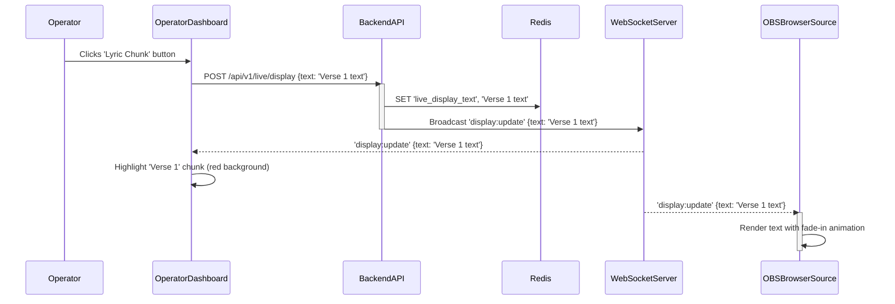

# ARCHITECTURE.md: PentasLirik

## System Overview

PentasLirik employs a modular, event-driven architecture designed for low-latency, real-time control of live stream graphics within a local area network (LAN). The system separates concerns into a web-based Operator Dashboard for user interaction, a robust Laravel backend for data management and business logic, a dedicated Laravel Reverb WebSocket server for real-time communication, and a lightweight HTML/JS Display Layer for rendering in OBS Studio. All components are containerized with Docker and fronted by Nginx for efficient deployment and traffic management on an Ubuntu server.

## High-Level Architecture Diagram

```mermaid
graph TD
    subgraph User Interfaces
        A["Operator Dashboard (React 19 + Vite)"]
        B["OBS Browser Source (React OBSDisplay Component)"]
    end

    subgraph Backend Services (Laravel Sail in Docker)
        C["Nginx (Reverse Proxy) / Express Dev Server (server.ts)"]
        D["Backend API (Laravel 13 via Sail)"]
        E["WebSocket Server (Laravel Reverb via Sail)"]
        F["Database (MySQL via Sail)"]
        G["Cache (Redis via Sail)"]
    end

    A -- HTTP/S (API Requests) --> C
    A -- WebSocket (Real-time Events) --> C
    B -- HTTP/S (Initial Display Load & State Fetch) --> C
    B -- WebSocket (Real-time Events) --> C

    C -- HTTP/S (Proxy API) --> D
    C -- WebSocket (Proxy WebSocket) --> E

    D -- Reads/Writes --> F: Data Persistence (Songs, Lyrics, Setlists, Users)
    D -- Reads/Writes --> G: Live State & Cache
    D -- Broadcasts --> E: Send Real-time Events

    E -- Publishes/Subscribes --> G: (Optional: Reverb internal state)
```

## Component Breakdown

### Operator Dashboard (React 19 + TypeScript + Vite 6)
The Operator Dashboard is the primary user interface for controlling PentasLirik. Built with React 19, TypeScript, styled with Tailwind CSS v4, and animated with Framer Motion, it provides a responsive, type-safe, and interactive experience for managing content and live operations.
*   **Responsibilities:**
    *   Render the three-column UI (`SongLibrary.tsx`, `SetlistRundown.tsx`, `LiveControlPanel.tsx`).
    *   Handle user authentication and authorization (`LoginView.tsx`, `UserManagementModal.tsx`).
    *   Manage song, lyric, and setlist CRUD operations via API calls to the Backend (`SongModal.tsx`).
    *   Listen for WebSocket events (`display:update`, `display:clear`) from the Backend to update its UI (e.g., highlighting the currently live lyric chunk with solid red background).
    *   Send API requests to the Backend to trigger live display updates or clear the screen.
    *   Implement global keyboard shortcuts (`Spacebar` for next chunk, `Escape` for clear screen).
    *   Display visual indicators for live connection status (`Navbar.tsx`).

### Backend API (Laravel 13 via Sail)
The Laravel backend serves as the central brain of the application, managing data, business logic, and orchestrating real-time events. Executed within the Dockerized Laravel Sail environment (PHP 8.4).
*   **Responsibilities:**
    *   **Authentication & Authorization:** Secure API endpoints and manage user roles (Admin, Operator).
    *   **Content Management:** CRUD operations for `Songs` (title, artist) and `Lyrics` (chunking logic, relation to songs).
    *   **Setlist Management:** CRUD operations for `Setlists` and their associated items.
    *   **Live State Management:** Store the current live display text in Redis for low-latency access and state synchronization.
    *   **API Endpoints:** Provide RESTful APIs for the Operator Dashboard and the OBS Browser Source (for initial state fetch).
    *   **Event Broadcasting:** Trigger real-time WebSocket events via Laravel Reverb to update connected clients (Operator Dashboards and OBS Browser Sources) when the live display state changes.
    *   **Lyric Chunking:** Process raw lyric text into displayable chunks based on `[TAG]` delimiters.

### WebSocket Server (Laravel Reverb)
Laravel Reverb provides the high-performance, low-latency WebSocket communication layer essential for real-time updates (`./vendor/bin/sail artisan reverb:start`).
*   **Responsibilities:**
    *   Maintain persistent WebSocket connections with all connected Operator Dashboards and OBS Browser Sources.
    *   Receive broadcast events from the Backend API.
    *   Efficiently distribute real-time messages (`display:update`, `display:clear`) to all subscribed clients.
    *   Operate as a standalone service, integrated seamlessly with the Laravel application.

### OBS Browser Source (React OBSDisplay Component)
This is the display component rendered directly within OBS Studio as a Browser Source (routed to `/display` or `/display.html`). It is designed to be extremely lightweight and performant.
*   **Responsibilities:**
    *   Establish and maintain a persistent WebSocket connection to the Laravel Reverb / WebSocket server.
    *   Upon loading or reloading, perform an initial HTTP GET request to the Backend API (`/api/v1/live/state`) to fetch and display the last known live state, preventing a "flash" of empty content.
    *   Listen for `display:update` and `display:clear` WebSocket events.
    *   Render received text content with a transparent background, fixed lower-third position, bold sans-serif font, and strong text-shadow.
    *   Apply smooth fade-in/fade-out animations (300-500ms) using Framer Motion (`motion.div`).

### Database (MySQL via Sail)
MySQL (provisioned via Laravel Sail Docker container) serves as the primary persistent data store for the application.
*   **Responsibilities:**
    *   Store `Users` data (authentication credentials, roles).
    *   Persist `Songs` information (title, artist).
    *   Store `Lyrics` content, including chunked structures.
    *   Manage `Setlists` and their ordered `SetlistItem` relationships.
    *   Ensure data integrity and transactional consistency.

### Cache (Redis via Sail)
Redis is utilized as a high-performance in-memory data store for ephemeral and frequently accessed data.
*   **Responsibilities:**
    *   Store the current `live_display_text` state, providing extremely fast read/write access for state synchronization and broadcasting.
    *   Potentially used for Laravel's session management or other caching needs to reduce database load.

### Nginx (Reverse Proxy)
Nginx acts as the entry point for all HTTP/S and WebSocket traffic, routing requests to the appropriate backend services.
*   **Responsibilities:**
    *   Serve as a reverse proxy for the Laravel Backend API.
    *   Proxy WebSocket connections to the Laravel Reverb server.
    *   Serve static assets for the Operator Dashboard and the OBS Browser Source.
    *   Handle SSL termination (if HTTPS is configured).
    *   Provide basic load balancing (though not critical for a single-instance LAN deployment, it's a standard practice).

### Docker & Laravel Sail
Docker and Laravel Sail are used for containerization and local development environment management.
*   **Responsibilities:**
    *   Package PHP 8.4, Laravel Reverb, MySQL, Redis, and Nginx into isolated Docker containers via Sail (`docker-compose.yml`).
    *   Ensure consistent runtime environments across development and production.
    *   Facilitate easy development workflow using `./vendor/bin/sail`.

## Critical Flow Sequence Diagram

The following sequence diagram illustrates the most critical user flow: an operator sending a lyric chunk to the live display.



## Deployment Strategy

PentasLirik is designed for deployment on a single Ubuntu Server within a Local Area Network (LAN) using Docker and Nginx.

1.  **Containerization:** Each core component (Laravel Backend, Laravel Reverb, React Frontend build, MySQL, Redis, Nginx) will run in its own Docker container. A `docker-compose.yml` file will define the services, networks, and volumes for the entire application stack.
2.  **Nginx as Reverse Proxy:** Nginx will be configured to listen on standard HTTP/S ports (e.g., 80/443). It will act as a reverse proxy, routing:
    *   API requests (`/api/*`) to the Laravel Backend container.
    *   WebSocket connections (`/ws`) to the Laravel Reverb container.
    *   Static assets for the Operator Dashboard (React build) and the OBS Browser Source (HTML/JS) directly.
3.  **Data Persistence:** MySQL and Redis containers will use Docker volumes to persist their data on the host machine, ensuring data is not lost if containers are stopped or removed.
4.  **Network Configuration:** Docker Compose will create an internal Docker network for the containers to communicate with each other. Nginx will expose the necessary ports to the host machine's LAN interface.
5.  **Access:**
    *   The Operator Dashboard will be accessible via a web browser on any device connected to the LAN, pointing to the server's IP address or hostname.
    *   The OBS Browser Source will be configured in OBS Studio to point to a specific URL on the server (e.g., `http://<server_ip>/display`).
6.  **Monitoring & Management:** Standard Docker commands and `docker-compose` utilities will be used for starting, stopping, and managing the application stack. Logs from individual containers can be accessed for debugging.