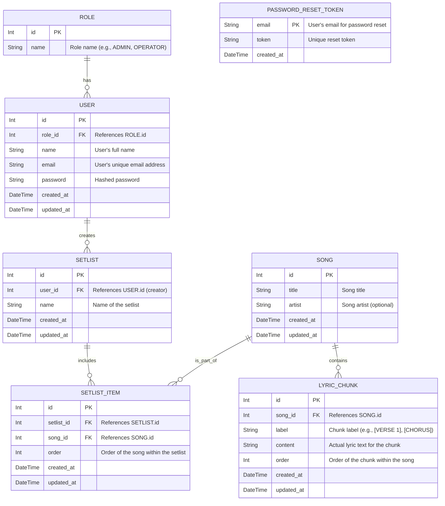

# DATABASE.md: PentasLirik

This document outlines the database schema for the PentasLirik project (using MySQL provisioned via Laravel Sail Docker environment), detailing the entities, attributes, relationships, and schema definitions. The database is designed to support the core functionalities of managing songs, lyrics, setlists, and user authentication for the live streaming control system.

## 1. Entity Relationship Diagram (ERD)

The following ERD illustrates the primary entities within the PentasLirik system and their relationships.



## 2. Table Definitions

This section provides detailed definitions for the core database tables.

### 2.1. `users` Table

*   **Purpose:** Stores user authentication and profile information.
*   **Columns:**

| Column Name | Data Type | Constraints | Description |
|:------------|:----------|:------------------------|:----------------------------------------------|
| `id` | INT | PK, AUTO_INCREMENT | Unique identifier for the user. |
| `role_id` | INT | FK (roles.id), NOT NULL | Foreign key to the `roles` table. |
| `name` | VARCHAR | NOT NULL | Full name of the user. |
| `email` | VARCHAR | NOT NULL, UNIQUE | Unique email address for login. |
| `password` | VARCHAR | NOT NULL | Hashed password for authentication. |
| `created_at`| TIMESTAMP | NOT NULL, DEFAULT NOW() | Timestamp when the user record was created. |
| `updated_at`| TIMESTAMP | NOT NULL, DEFAULT NOW() | Timestamp of the last update to the record. |

*   **Indexes:**
    *   `PRIMARY KEY (id)`
    *   `UNIQUE (email)`
    *   `INDEX (role_id)`

### 2.2. `roles` Table

*   **Purpose:** Defines the different user roles within the system (e.g., Admin, Operator).
*   **Columns:**

| Column Name | Data Type | Constraints | Description |
|:------------|:----------|:------------------------|:----------------------------------------------|
| `id` | INT | PK, AUTO_INCREMENT | Unique identifier for the role. |
| `name` | VARCHAR | NOT NULL, UNIQUE | Name of the role (e.g., 'ADMIN', 'OPERATOR'). |

*   **Indexes:**
    *   `PRIMARY KEY (id)`
    *   `UNIQUE (name)`

### 2.3. `songs` Table

*   **Purpose:** Stores information about individual songs in the library.
*   **Columns:**

| Column Name | Data Type | Constraints | Description |
|:------------|:----------|:------------------------|:----------------------------------------------|
| `id` | INT | PK, AUTO_INCREMENT | Unique identifier for the song. |
| `title` | VARCHAR | NOT NULL | Title of the song. |
| `artist` | VARCHAR | NULLABLE | Artist of the song (optional). |
| `created_at`| TIMESTAMP | NOT NULL, DEFAULT NOW() | Timestamp when the song record was created. |
| `updated_at`| TIMESTAMP | NOT NULL, DEFAULT NOW() | Timestamp of the last update to the record. |

*   **Indexes:**
    *   `PRIMARY KEY (id)`
    *   `INDEX (title)`
    *   `INDEX (artist)`

### 2.4. `lyric_chunks` Table

*   **Purpose:** Stores individual lyric chunks associated with a song. This allows for granular control over lyric display.
*   **Columns:**

| Column Name | Data Type | Constraints | Description |
|:------------|:----------|:------------------------------------------|:--------------------------------------------------|
| `id` | INT | PK, AUTO_INCREMENT | Unique identifier for the lyric chunk. |
| `song_id` | INT | FK (songs.id), NOT NULL, ON DELETE CASCADE| Foreign key to the `songs` table. |
| `label` | VARCHAR | NOT NULL | Label for the chunk (e.g., `[VERSE 1]`, `[CHORUS]`). |
| `content` | TEXT | NOT NULL | The actual lyric text for this chunk. |
| `order` | INT | NOT NULL, DEFAULT 0 | Display order of the chunk within its song. |
| `created_at`| TIMESTAMP | NOT NULL, DEFAULT NOW() | Timestamp when the chunk record was created. |
| `updated_at`| TIMESTAMP | NOT NULL, DEFAULT NOW() | Timestamp of the last update to the record. |

*   **Indexes:**
    *   `PRIMARY KEY (id)`
    *   `UNIQUE (song_id, order)` (Ensures unique order per song)
    *   `INDEX (song_id)`

### 2.5. `setlists` Table

*   **Purpose:** Stores definitions of setlists, which are ordered collections of songs for an event.
*   **Columns:**

| Column Name | Data Type | Constraints | Description |
|:------------|:----------|:------------------------------------------|:----------------------------------------------|
| `id` | INT | PK, AUTO_INCREMENT | Unique identifier for the setlist. |
| `user_id` | INT | FK (users.id), NOT NULL, ON DELETE CASCADE| Foreign key to the `users` table (creator). |
| `name` | VARCHAR | NOT NULL | Name of the setlist. |
| `created_at`| TIMESTAMP | NOT NULL, DEFAULT NOW() | Timestamp when the setlist record was created.|
| `updated_at`| TIMESTAMP | NOT NULL, DEFAULT NOW() | Timestamp of the last update to the record. |

*   **Indexes:**
    *   `PRIMARY KEY (id)`
    *   `INDEX (user_id)`

### 2.6. `setlist_items` Table

*   **Purpose:** Links songs to a specific setlist and defines their order within that setlist.
*   **Columns:**

| Column Name | Data Type | Constraints | Description |
|:------------|:----------|:------------------------------------------|:--------------------------------------------------|
| `id` | INT | PK, AUTO_INCREMENT | Unique identifier for the setlist item. |
| `setlist_id`| INT | FK (setlists.id), NOT NULL, ON DELETE CASCADE| Foreign key to the `setlists` table. |
| `song_id` | INT | FK (songs.id), NOT NULL, ON DELETE CASCADE| Foreign key to the `songs` table. |
| `order` | INT | NOT NULL, DEFAULT 0 | Display order of the song within its setlist. |
| `created_at`| TIMESTAMP | NOT NULL, DEFAULT NOW() | Timestamp when the setlist item record was created.|
| `updated_at`| TIMESTAMP | NOT NULL, DEFAULT NOW() | Timestamp of the last update to the record. |

*   **Indexes:**
    *   `PRIMARY KEY (id)`
    *   `UNIQUE (setlist_id, order)` (Ensures unique order per setlist)
    *   `INDEX (setlist_id)`
    *   `INDEX (song_id)`

### 2.7. `password_reset_tokens` Table

*   **Purpose:** Stores tokens for user password reset functionality.
*   **Columns:**

| Column Name | Data Type | Constraints | Description |
|:------------|:----------|:------------------------|:----------------------------------------------|
| `email` | VARCHAR | PK, NOT NULL | The email of the user requesting a reset. |
| `token` | VARCHAR | NOT NULL, UNIQUE | The unique token sent to the user. |
| `created_at`| TIMESTAMP | NOT NULL, DEFAULT NOW() | Timestamp when the token was created. |

*   **Indexes:**
    *   `PRIMARY KEY (email)`
    *   `UNIQUE (token)`

## 3. Prisma Schema

This is the complete Prisma schema for the PentasLirik project, ready for use with a PostgreSQL database. Note that the `roles` table from the ERD is represented as an `enum UserRole` in Prisma for simplicity and direct integration with the `User` model.

```prisma
// schema.prisma

generator client {
  provider = "prisma-client-js"
}

datasource db {
  provider = "postgresql"
  url      = env("DATABASE_URL")
}

// Defines the possible roles for users in the system.
enum UserRole {
  ADMIN
  OPERATOR
}

// Represents a user account in the system.
model User {
  id            Int       @id @default(autoincrement())
  name          String
  email         String    @unique
  password      String
  role          UserRole  @default(OPERATOR) // Default role for new users
  createdAt     DateTime  @default(now()) @map("created_at")
  updatedAt     DateTime  @updatedAt @map("updated_at")

  setlists      Setlist[] // A user can create multiple setlists

  @@map("users")
}

// Represents a song in the library.
model Song {
  id            Int           @id @default(autoincrement())
  title         String
  artist        String?       // Artist is optional
  createdAt     DateTime      @default(now()) @map("created_at")
  updatedAt     DateTime      @updatedAt @map("updated_at")

  lyricChunks   LyricChunk[]  // A song has many lyric chunks
  setlistItems  SetlistItem[] // A song can appear in multiple setlist items

  @@map("songs")
}

// Represents a single chunk of lyrics for a song.
model LyricChunk {
  id            Int      @id @default(autoincrement())
  songId        Int      @map("song_id")
  label         String   // e.g., "[VERSE 1]", "[CHORUS]"
  content       String   // The actual lyric text for this chunk
  order         Int      @default(0) // Order of the chunk within the song
  createdAt     DateTime @default(now()) @map("created_at")
  updatedAt     DateTime @updatedAt @map("updated_at")

  song          Song     @relation(fields: [songId], references: [id], onDelete: Cascade)

  @@unique([songId, order]) // Ensures unique order for chunks within a song
  @@map("lyric_chunks")
}

// Represents a collection of songs for an event.
model Setlist {
  id            Int           @id @default(autoincrement())
  userId        Int           @map("user_id")
  name          String
  createdAt     DateTime      @default(now()) @map("created_at")
  updatedAt     DateTime      @updatedAt @map("updated_at")

  user          User          @relation(fields: [userId], references: [id], onDelete: Cascade)
  setlistItems  SetlistItem[] // A setlist has many items

  @@map("setlists")
}

// Represents a song's inclusion in a setlist, with a specific order.
model SetlistItem {
  id            Int      @id @default(autoincrement())
  setlistId     Int      @map("setlist_id")
  songId        Int      @map("song_id")
  order         Int      @default(0) // Order of the song within the setlist
  createdAt     DateTime @default(now()) @map("created_at")
  updatedAt     DateTime @updatedAt @map("updated_at")

  setlist       Setlist  @relation(fields: [setlistId], references: [id], onDelete: Cascade)
  song          Song     @relation(fields: [songId], references: [id], onDelete: Cascade)

  @@unique([setlistId, order]) // Ensures unique order for items within a setlist
  @@map("setlist_items")
}

// Stores tokens for password reset functionality.
model PasswordResetToken {
  email     String   @id @map("email") // Email is the primary key for password reset tokens
  token     String   @unique
  createdAt DateTime @default(now()) @map("created_at")

  @@map("password_reset_tokens")
}
```