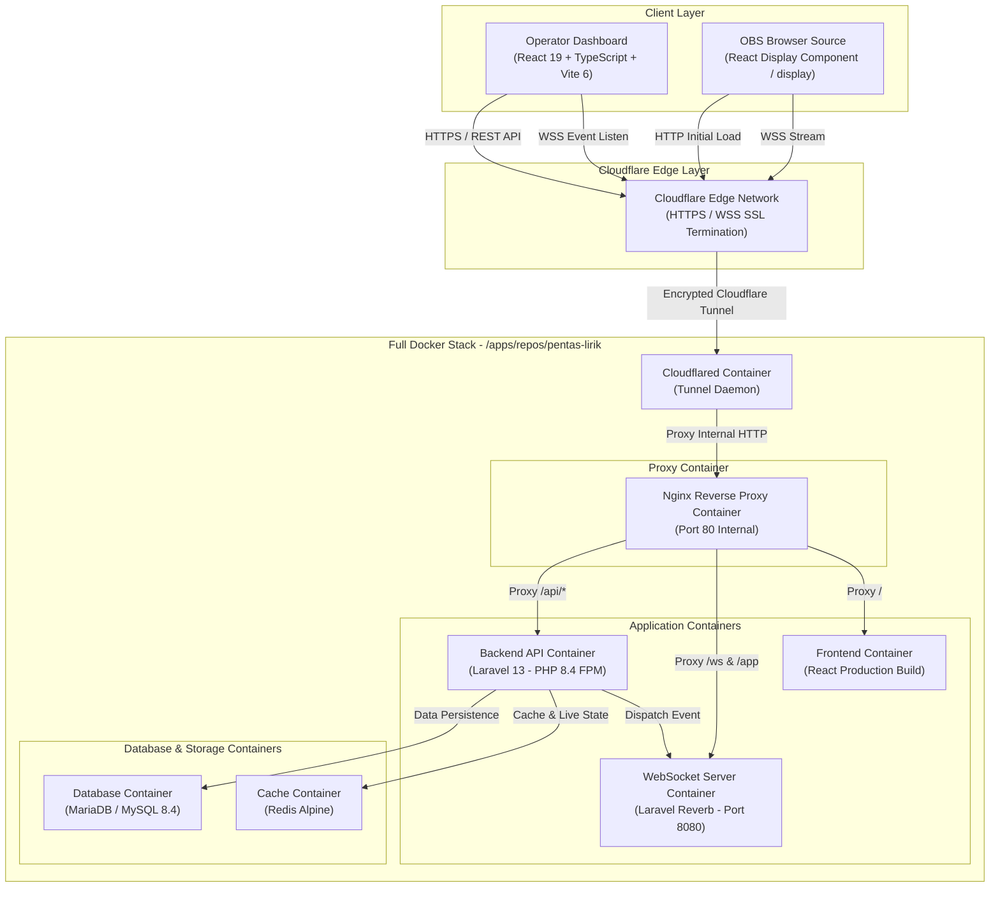
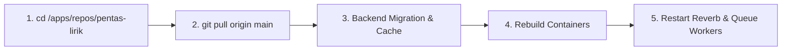

# DEPLOYMENT.md: PentasLirik Full-Docker Deployment & Infrastructure Guide

Dokumen ini berisi analisis arsitektur (backend & frontend), panduan langkah demi langkah deployment berbasis **100% Full Docker** (tanpa instalasi runtime langsung di host VPS) untuk pertama kali maupun saat ada perubahan kode, panduan penanganan skenario jika di server sudah terdapat container **MariaDB/MySQL & Redis** eksisting, serta **panduan integrasi Cloudflare Tunnels (Zero Trust)**.

---

## 1. Analisis Arsitektur & Komponen Proyek (Full Docker Stack)

Seluruh komponen **PentasLirik** dikemas dalam kontainer Docker (*containerized architecture*) untuk menjamin isolasi total, portabilitas tinggi, serta kemudahan instalasi di server VPS tanpa perlu menginstal PHP, Node.js, Nginx, atau MariaDB secara native di server host.



### 1.1. Detail Komponen Kontainer
1. **Frontend Container (`frontend`)**: Memuat kompilasi produksi React 19 + Vite 6. Disajikan via web server ringan internal.
2. **Backend API Container (`backend`)**: Mengesekusi Laravel 13 API (PHP 8.4) untuk manajemen lagu, lirik, setlist, otentikasi, dan algoritma *lyric chunking*.
3. **Laravel Reverb Container (`reverb`)**: Kontainer WebSocket independen (`php artisan reverb:start`) untuk mentransmisikan pergerakan lirik secara real-time ke OBS Studio & Dashboard.
4. **Nginx Reverse Proxy Container (`nginx`)**: Kontainer pintu masuk (*gateway*) internal yang meroute `/api/*` ke backend, `/ws` ke Reverb, dan `/` ke frontend.
5. **Cloudflared Container (`cloudflared`)**: Kontainer pendukung Cloudflare Tunnel yang menghubungkan Nginx internal secara aman ke jaringan global Cloudflare tanpa perlu membuka port publik (80/443) pada VPS.
6. **Database Container (`database`)**: MariaDB 11.x / MySQL 8.4 terisolasi untuk data pengguna dan lirik.
7. **Cache Container (`redis`)**: Redis Alpine untuk state lirik live, session, dan queue.

---

## 2. Langkah-Langkah Deployment Pertama Kali (Initial Setup - Full Docker)

Semua repositori dan file konfigurasi disimpan di direktori **`/apps/repos/pentas-lirik`**. Host OS VPS hanya memerlukan **Docker Engine & Docker Compose Plugin** (tidak perlu menginstal PHP, Composer, Node.js, Nginx, atau MariaDB di host OS!).

### 2.1. Persyaratan Server VPS
* **OS**: Ubuntu 22.04 LTS / 24.04 LTS / Debian 12
* **Spesifikasi**: Minimal 2 vCPU Cores, 2 GB RAM (Rekomendasi 4 GB RAM + 2 GB Swap), 25 GB SSD Storage.
* **Akses**: User dengan hak akses `sudo`.

---

### 2.2. Step 1: Install Docker Engine pada Host VPS
Jalankan perintah berikut pada VPS (Hanya menginstall Docker & Git):

```bash
# Update repository & sistem dasar VPS
sudo apt update && sudo apt upgrade -y
sudo apt install -y curl git ufw

# Setup Firewall VPS (Hanya izinkan SSH, Port 80/443 TIDAK WAJIB DIBUKA jika pakai Cloudflare Tunnel!)
sudo ufw allow 22/tcp
sudo ufw --force enable

# Install Docker Engine & Docker Compose Plugin
curl -fsSL https://get.docker.com -o get-docker.sh
sudo sh get-docker.sh
sudo usermod -aG docker $USER
newgrp docker
```

---

### 2.3. Step 2: Clone Repository ke `/apps/repos/`
Buat direktori `/apps/repos/` dan lakukan clone repositori:

```bash
# Buat direktori /apps/repos/
sudo mkdir -p /apps/repos
sudo chown -R $USER:$USER /apps/repos

# Clone repositori proyek
cd /apps/repos
git clone https://github.com/MarcYovian/pentas-lirik.git
cd /apps/repos/pentas-lirik
```

---

### 2.4. Step 3: Konfigurasi Environment File (`.env`)
Salin file konfigurasi `.env` di lokasi repositori `/apps/repos/pentas-lirik`:

```bash
cd /apps/repos/pentas-lirik

# Setup environment file backend (otomatis digunakan oleh seluruh container Docker)
cp backend/.env.example backend/.env
```

Edit file `backend/.env` untuk produksi:
```bash
nano backend/.env
```

Isi file `backend/.env`:
```env
APP_NAME=Lyrics
APP_ENV=production
APP_KEY= # Dibuat otomatis oleh command artisan key:generate
APP_DEBUG=false
APP_URL=https://lyrics.kapelstyohanesrasul.com

APP_LOCALE=en
APP_FALLBACK_LOCALE=en
APP_FAKER_LOCALE=en_US

LOG_CHANNEL=stack
LOG_LEVEL=info

# Database Configuration (Terhubung ke kontainer mysql di Docker)
DB_CONNECTION=mysql
DB_HOST=mysql
DB_PORT=3306
DB_DATABASE=pentas_lirik
DB_USERNAME=pentas_user
DB_PASSWORD=SecurePasswordProd123!

# Redis Configuration (Terhubung ke kontainer redis di Docker)
SESSION_DRIVER=redis
SESSION_LIFETIME=120
SESSION_ENCRYPT=false
SESSION_PATH=/
SESSION_DOMAIN=null

QUEUE_CONNECTION=redis
CACHE_STORE=redis

REDIS_CLIENT=phpredis
REDIS_HOST=redis
REDIS_PASSWORD=null
REDIS_PORT=6379
REDIS_PREFIX=pentas_lirik_

# Broadcast & WebSocket Reverb Configuration
BROADCAST_CONNECTION=reverb
REVERB_APP_ID=pentaslirik_prod
REVERB_APP_KEY=pentaslirik_key_prod
REVERB_APP_SECRET=pentaslirik_secret_prod
REVERB_HOST=lyrics.kapelstyohanesrasul.com
REVERB_PORT=443
REVERB_SCHEME=https

# Frontend Vite Configuration
VITE_APP_NAME="${APP_NAME}"
VITE_API_BASE_URL="${APP_URL}/api/v1"
VITE_REVERB_APP_KEY="${REVERB_APP_KEY}"
VITE_REVERB_HOST="${REVERB_HOST}"
VITE_REVERB_PORT="${REVERB_PORT}"
VITE_REVERB_SCHEME="${REVERB_SCHEME}"

# Cloudflare Tunnel Token
TUNNEL_TOKEN=eyJhYmNkZWZna... # Masukkan token dari Cloudflare Zero Trust
```

---

### 2.5. Step 4: Menjalankan Full Docker Stack & Inisialisasi
Eksekusi kompilasi dan penyalaan seluruh stack kontainer dari `/apps/repos/pentas-lirik`:

```bash
cd /apps/repos/pentas-lirik

# Build & Run seluruh container di background
docker compose up -d --build

# Generate App Key Laravel di dalam kontainer backend
docker compose exec backend php artisan key:generate

# Jalankan Database Migration & Seeding di dalam kontainer backend
docker compose exec backend php artisan migrate --force --seed

# Optimasi Cache Laravel Production
docker compose exec backend php artisan config:cache
docker compose exec backend php artisan route:cache
docker compose exec backend php artisan view:cache
docker compose exec backend php artisan event:cache
```

---

### 2.6. Step 5: Verifikasi Deployment Awal
1. **Akses Dashboard**: Buka `https://pentaslirik.yourdomain.com` (Harus muncul halaman login Operator).
2. **Akses OBS Display**: Buka `https://pentaslirik.yourdomain.com/display` (Tampilan layar transparan untuk OBS Studio).
3. **Cek Health Check API**:
   ```bash
   curl -I https://pentaslirik.yourdomain.com/api/v1/state/live
   ```
   *Response*: `HTTP/1.1 200 OK`.

---

## 3. Langkah-Langkah Deployment Saat Ada Perubahan Kode (Code Updates / Redeployment)

Jika terdapat pembaruan kode di repositori GitHub (misalnya *bugfix*, fitur baru, atau pembaruan UI), lakukan redeployment tanpa *downtime* dengan langkah-langkah berikut:



Jalankan perintah ini di VPS:

```bash
# 1. Masuk ke direktori repositori
cd /apps/repos/pentas-lirik

# 2. Tarik kode terbaru dari GitHub
git pull origin main

# 3. Update Composer Dependencies di dalam kontainer backend
docker compose exec backend composer install --no-dev --optimize-autoloader

# 4. Jalankan Skema Migration Database terbaru
docker compose exec backend php artisan migrate --force

# 5. Reset & Re-cache Konfigurasi Laravel
docker compose exec backend php artisan config:clear
docker compose exec backend php artisan route:clear
docker compose exec backend php artisan view:clear
docker compose exec backend php artisan cache:clear

docker compose exec backend php artisan config:cache
docker compose exec backend php artisan route:cache
docker compose exec backend php artisan view:cache
docker compose exec backend php artisan event:cache

# 6. Rebuild kontainer frontend & backend yang mengalami perubahan
docker compose up -d --build frontend backend

# 7. Restart Service Queue Worker & Reverb WebSocket Server
docker compose exec backend php artisan queue:restart
docker compose restart reverb
```

---

## 4. Penanganan Skenario: Di Server VPS Sudah Ada Docker MariaDB/MySQL & Redis Eksisting

### ❓ Pertanyaan Utama:
> *"Jika di server VPS sudah ada Docker MariaDB dan Redis yang berjalan untuk proyek lain, apakah proyek PentasLirik ini harus memakai Docker MariaDB/Redis yang sudah ada atau menginstal kontainer MariaDB/Redis baru?"*

---

### 4.1. Analisis & Jawaban Rekomendasi

| Pendekatan | Deskripsi | Kelebihan | Kekurangan | Kapan Dipilih? |
| :--- | :--- | :--- | :--- | :--- |
| **Pendekatan 1: Menginstal MariaDB & Redis Baru (Isolated Stack)** | Proyek PentasLirik membawa kontainer `mariadb` dan `redis` sendiri di dalam `docker-compose.yml`. | • **Isolasi 100%**<br/>• Bebas dari risiko konflik data/versi.<br/>• Lifecycle & backup terpisah.<br/>• Sangat aman dan portabel. | Membutuhkan alokasi RAM tambahan (+250MB RAM). | **REKOMENDASI UTAMA (Best Practice)** jika RAM VPS mencukupi (>= 2 GB RAM). |
| **Pendekatan 2: Menggunakan Docker MariaDB & Redis Eksisting (Shared Stack)** | PentasLirik terhubung ke kontainer MariaDB & Redis yang sudah menyala di VPS. | **Sangat Hemat RAM** (Tidak ada kontainer database tambahan yang dibuat). | • Harus mengatur nama database/prefix.<br/>• Berisiko menimpa cache key jika tanpa prefix Redis.<br/>• Tergantung pada kestabilan DB eksisting. | Dipilih jika **RAM VPS sangat terbatas (< 2 GB RAM)**. |

---

### 4.2. Cara Penanganan Pendekatan 1: Menginstal Kontainer Baru Terisolasi (REKOMENDASI)

Dalam pendekatan ini, proyek PentasLirik tetap menyalakan kontainer MariaDB & Redis sendiri. 

#### Menghindari Konflik Port (Port Collision):
Jika MariaDB eksisting di server sudah memakai port `3306` dan Redis eksisting memakai port `6379` di Host OS:

1. **Opsi Terbaik**: **HAPUS PUBLISH PORT (Seksi `ports`)** pada service `mysql/mariadb` dan `redis` di `docker-compose.yml`. Kontainer Laravel PentasLirik akan berkomunikasi dengan MariaDB & Redis via **Docker Internal Bridge Network (`sail`)**, sehingga **0% risiko konflik port di Host OS**.
2. **Opsi Alternatif**: Jika ingin tetap membuka port ke host untuk keperluan GUI Client (DBeaver/TablePlus), gunakan port mapping host yang berbeda:
   ```yaml
   services:
     mysql:
       image: 'mariadb:11.4'
       ports:
         - '3307:3306' # Host port 3307 di-map ke container port 3306
     redis:
       image: 'redis:alpine'
       ports:
         - '6380:6379' # Host port 6380 di-map ke container port 6379
   ```

---

### 4.3. Cara Penanganan Pendekatan 2: Menggabungkan ke Docker MariaDB & Redis Eksisting (Shared)

Jika RAM VPS terbatas dan Anda ingin memanfaatkan kontainer MariaDB & Redis yang **sudah menyala di server VPS**:

#### Step 1: Menghubungkan Docker Network
Pastikan kontainer PentasLirik dapat berkomunikasi dengan kontainer MariaDB eksisting via Docker Network. Misal nama network eksisting di VPS adalah `shared_network`:

Tambahkan pada `docker-compose.yml` PentasLirik:
```yaml
networks:
  sail:
    driver: bridge
  shared_network:
    external: true
```

Lalu daftarkan service backend ke network tersebut:
```yaml
services:
  backend:
    networks:
      - sail
      - shared_network
```

#### Step 2: Konfigurasi Database MariaDB Eksisting
1. Masuk ke kontainer MariaDB eksisting di VPS dan buat database serta user baru khusus untuk PentasLirik:
   ```sql
   CREATE DATABASE pentas_lirik_prod CHARACTER SET utf8mb4 COLLATE utf8mb4_unicode_ci;
   CREATE USER 'pentas_user'@'%' IDENTIFIED BY 'PasswordKuat123!';
   GRANT ALL PRIVILEGES ON pentas_lirik_prod.* TO 'pentas_user'@'%';
   FLUSH PRIVILEGES;
   ```
2. **Jika Nama Database Sama Persis (Misal `pentas_lirik` sudah dipakai aplikasi lain)**:
   Gunakan **Database Prefix** pada file `/apps/repos/pentas-lirik/backend/.env`:
   ```env
   DB_HOST=nama_container_mariadb_eksisting # Misal: mariadb_global
   DB_PORT=3306
   DB_DATABASE=pentas_lirik
   DB_USERNAME=pentas_user
   DB_PASSWORD=PasswordKuat123!
   DB_PREFIX=pl_
   ```
   *Hasil*: Seluruh tabel Laravel PentasLirik akan dibuat dengan nama `pl_users`, `pl_songs`, `pl_lyrics`, `pl_setlists` sehingga aman dan tidak saling mengganggu dengan tabel milik aplikasi lain.

#### Step 3: Konfigurasi Redis Eksisting
Redis menyimpan key dalam ruang nama tunggal. Untuk mencegah cache/queue PentasLirik menimpa data aplikasi lain:

1. **Wajib Pasang Prefix Key Redis**:
   Edit `/apps/repos/pentas-lirik/backend/.env`:
   ```env
   REDIS_HOST=nama_container_redis_eksisting # Misal: redis_global
   REDIS_PORT=6379
   REDIS_PREFIX=pentaslirik_prod_
   CACHE_PREFIX=pentaslirik_cache_
   ```
2. **Isolasi Database Index Redis**:
   Secara default Redis memiliki index `0` sampai `15`. Gunakan index khusus (misal DB `3`) untuk PentasLirik:
   ```env
   REDIS_DB=3
   REDIS_CACHE_DB=3
   ```

---

## 5. Integrasi Cloudflare Tunnels (Cloudflare Zero Trust Deployment)

**Cloudflare Tunnel** memungkinkan aplikasi PentasLirik diakses melalui internet publik dengan domain Anda tanpa perlu membuka port 80 / 443 pada firewall VPS, serta memberikan proteksi SSL (HTTPS/WSS) dan DDoS otomatis dari Cloudflare.

---

### 5.1. Keuntungan Menggunakan Cloudflare Tunnel
- **Tanpa Open Inbound Port**: Port 80 dan 443 pada UFW VPS dapat ditutup (*closed*).
- **Otomatis HTTPS & WSS**: Sertifikat SSL dikelola secara gratis oleh Cloudflare Edge.
- **Mendukung WebSocket**: Mendukung penuh lalu lintas WebSocket berlatensi rendah untuk Laravel Reverb (`/ws` dan `/app`).
- **Full Docker Integration**: Cukup menambahkan 1 kontainer `cloudflared` ke dalam `docker-compose.yml`.

---

### 5.2. Langkah 1: Buat Tunnel di Cloudflare Zero Trust Dashboard
1. Login ke [Cloudflare Zero Trust Dashboard](https://one.dash.cloudflare.com/).
2. Buka menu **Networks** -> **Tunnels** -> Klik **Create a Tunnel**.
3. Pilih nama tunnel, misal: `pentas-lirik-vps`.
4. Pada halaman *Choose connector*, pilih **Docker**.
5. Salin kode token yang diberikan (String acak panjang setelah `--token`).
   Example token: `eyJhYmNkZWZnaGlya2xtbm9wcXJzdHV2d3h5ejEyMzQ1Njc4O...`

---

### 5.3. Langkah 2: Tambahkan Service `cloudflared` pada `docker-compose.yml`

Tambahkan service berikut ke dalam file `docker-compose.yml` di `/apps/repos/pentas-lirik`:

```yaml
services:
  # ... (service frontend, backend, reverb, mysql, redis, nginx) ...

  cloudflared:
    image: cloudflare/cloudflared:latest
    container_name: pentas_lirik_cloudflared
    restart: unless-stopped
    command: tunnel --no-autoupdate run
    environment:
      - TUNNEL_TOKEN=${CLOUDFLARE_TUNNEL_TOKEN}
    networks:
      - sail
    depends_on:
      - nginx
```

Simpan token di dalam file `/apps/repos/pentas-lirik/.env`:
```env
CLOUDFLARE_TUNNEL_TOKEN=eyJhYmNkZWZnaGlya2xtbm9wcXJzdHV2d3h5ejEyMzQ1Njc4O...
```

---

### 5.4. Langkah 3: Konfigurasi Public Hostname di Cloudflare Dashboard
Pada halaman konfigurasi Tunnel di Cloudflare Dashboard:

1. Klik **Add a public hostname**.
2. Isi form berikut:
   * **Subdomain**: `pentaslirik` (atau sesuaikan dengan subdomain Anda)
   * **Domain**: `yourdomain.com`
   * **Path**: Biarkan kosong
   * **Type**: `HTTP`
   * **URL**: `nginx:80` *(Merujuk langsung ke nama kontainer Nginx di dalam Docker network)*
3. Klik **Save hostname**.

> 💡 **Catatan WebSocket (WSS)**: Pastikan fitur **WebSockets** di Cloudflare Dashboard teraktifkan (Buka dashboard Cloudflare -> Domain Anda -> **Network** -> Pastikan **WebSockets** posisi **ON**).

---

### 5.5. Langkah 4: Sesuaikan File Environment (`backend/.env`)
Pastikan variabel Reverb WebSocket dan Frontend menggunakan URL HTTPS & WSS Cloudflare:

Edit `/apps/repos/pentas-lirik/backend/.env`:
```env
APP_URL=https://pentaslirik.yourdomain.com

# Reverb WebSocket Konfigurasi via Cloudflare HTTPS/WSS
BROADCAST_CONNECTION=reverb
REVERB_APP_ID=pentaslirik_prod
REVERB_APP_KEY=pentaslirik_key_prod
REVERB_APP_SECRET=pentaslirik_secret_prod
REVERB_HOST=pentaslirik.yourdomain.com
REVERB_PORT=443
REVERB_SCHEME=https

# Frontend Vite Variables
VITE_API_BASE_URL=https://pentaslirik.yourdomain.com/api/v1
VITE_REVERB_APP_KEY=pentaslirik_key_prod
VITE_REVERB_HOST=pentaslirik.yourdomain.com
VITE_REVERB_PORT=443
VITE_REVERB_SCHEME=https
```

---

### 5.6. Langkah 5: Jalankan Tunnel Container & Verifikasi Status
Eksekusi di VPS:

```bash
cd /apps/repos/pentas-lirik

# Jalankan kontainer cloudflared
docker compose up -d cloudflared

# Cek log status koneksi tunnel
docker compose logs -f cloudflared
```

*Tanda Berhasil*: Log akan menunjukkan pesan:
`INF Registered tunnel connection connIndex=0 location=...`

Sekarang proyek **PentasLirik** sudah dapat diakses dari mana saja secara aman melalui `https://pentaslirik.yourdomain.com` tanpa membuka port publik di server VPS!

---

## 6. Pemantauan (Monitoring) & Rollback Prosedur

### 6.1. Log Pemantauan Real-time (Dari `/apps/repos/pentas-lirik`)
```bash
cd /apps/repos/pentas-lirik

# Cek status seluruh kontainer PentasLirik
docker compose ps

# Cek log transaksi Cloudflare Tunnel
docker compose logs -f cloudflared

# Cek log transaksi WebSocket Reverb secara real-time
docker compose logs -f reverb

# Cek log error backend Laravel
docker compose exec backend tail -f storage/logs/laravel.log
```

### 6.2. Prosedur Rollback Darurat
Jika rilis kode baru di `/apps/repos/pentas-lirik` mengalami kendala fatal:

```bash
cd /apps/repos/pentas-lirik

# 1. Rollback source code ke commit stabil sebelumnya
git reset --hard HEAD~1

# 2. Build & restart ulang kontainer
docker compose up -d --build

# 3. Clear cache & restart worker
docker compose exec backend php artisan config:cache
docker compose exec backend php artisan queue:restart
```

---

*Dokumen ini merupakan standar operasional prosedur (SOP) deployment Full-Docker untuk proyek PentasLirik.*