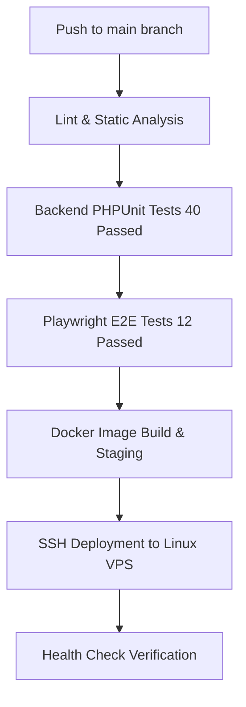

# DEPLOYMENT.md: PentasLirik Live Streaming Lyric Control System

Dokumen ini menguraikan strategi penyebaran (deployment), alur CI/CD, konfigurasi infrastruktur Linux VPS, kontainerisasi Docker, serta prosedur pemulihan (rollback) untuk proyek **PentasLirik**.

---

## 1. CI/CD Pipeline

Pipeline CI/CD mengotomatiskan proses pengujian kualitas kode, build image Docker, dan eksekusi deployment ke server VPS menggunakan **GitHub Actions**.



### 1.1. Pipeline Stages
1. **Source Code Checkout**: Mengambil source code terbaru dari branch `main` repository GitHub `https://github.com/MarcYovian/pentas-lirik.git`.
2. **Lint & Static Analysis**: Memeriksa type check TypeScript (`npm run lint` pada `frontend/`).
3. **Automated Unit & E2E Testing**:
   - Backend PHPUnit: `./vendor/bin/sail artisan test` (40 tests passed, 157 assertions).
   - Frontend Playwright E2E: `npm run test:e2e` (12 tests passed across multi-tab & shortcuts scenarios).
4. **Containerization & Docker Build**: Membangun image Docker produksi frontend (`frontend/Dockerfile`) dan kontainer backend Sail/Reverb.
5. **SSH Remote Deployment**: Menghubungkan GitHub Runner ke Linux VPS via SSH Keys untuk menjalankan perintah pull & restart container.
6. **Post-Deployment Health Check**: Memastikan HTTP 200 OK pada `/api/v1/state/live` dan konektivitas WebSocket Reverb pada `/ws`.

---

## 2. Environment Strategy

Proyek PentasLirik menggunakan isolasi lingkungan yang ketat antara pengembangan lokal dan rilis VPS.

| Environment | Purpose | Access | Database & Caching | Deployment Trigger |
| :--- | :--- | :--- | :--- | :--- |
| **Development** | Pengodean & pengujian fitur lokal. | Localhost Developer | Docker Sail MySQL & Redis | Local `./vendor/bin/sail up` |
| **Staging** | Validation UAT & E2E testing. | Tim QA & Streamer Test | Isolated MySQL Staging DB | Push ke branch `staging` |
| **Production** | Lingkungan live streaming operator. | Public / Operator LAN | VPS Dedicated MySQL & Redis | Merge ke branch `main` |

---

## 3. Containerization (Docker Stack)

Aplikasi PentasLirik dikemas penuh dalam ekosistem kontainer Docker untuk menjamin konsistensi performa antar environment.

### 3.1. Docker Architecture & Services
```
               ┌─────────────────────────────────────────┐
               │           Nginx Reverse Proxy           │
               │   (Port 80 / 443 SSL Certbot HTTPS)      │
               └────────────────────┬────────────────────┘
                                    │
         ┌──────────────────────────┼──────────────────────────┐
         │                          │                          │
         ▼                          ▼                          ▼
 ┌───────────────┐          ┌───────────────┐          ┌───────────────┐
 │   Frontend    │          │  Backend API  │          │ Laravel Reverb│
 │ React 19 Node │          │  Laravel 13   │          │ WebSocket /ws │
 │   (Port 5173) │          │   (Port 80)   │          │  (Port 8080)  │
 └───────────────┘          └───────┬───────┘          └───────────────┘
                                    │
                                    ▼
                            ┌───────────────┐
                            │ Redis & MySQL │
                            │ Cache & Data  │
                            └───────────────┘
```

### 3.2. Entry Points & Startup Commands
* **Nginx Reverse Proxy**: Directing `/api/*` -> Backend API (Port 80), `/ws` & `/app` -> Laravel Reverb (Port 8080), `/` -> React Frontend (Port 5173).
* **Backend API & Migrations**: `php artisan migrate --force && php artisan config:cache && php artisan route:cache`
* **Laravel Reverb WebSocket**: `php artisan reverb:start --host=0.0.0.0 --port=8080`
* **Frontend React Production**: `node dist/server.cjs`

---

## 4. Linux VPS Infrastructure & Setup Guide

PentasLirik di-deploy pada **Linux VPS Dedicated** (Ubuntu 22.04 LTS / 24.04 LTS).

### 4.1. Spesifikasi Server VPS Minimum
* **CPU**: 2 vCPU Cores
* **RAM**: 4 GB RAM (Minimum 2 GB RAM dengan 2 GB Swap)
* **Storage**: 25 GB SSD
* **OS**: Ubuntu 22.04 LTS 64-bit

### 4.2. Langkah-langkah Setup VPS dari Nol

#### Step 1: Install Docker & Docker Compose Plugin
```bash
sudo apt update && sudo apt upgrade -y
sudo apt install -y curl git ufw fail2ban

# Install Docker Engine
curl -fsSL https://get.docker.com -o get-docker.sh
sudo sh get-docker.sh
sudo usermod -aG docker $USER
```

#### Step 2: Clone Repository
```bash
git clone https://github.com/MarcYovian/pentas-lirik.git /var/www/pentas-lirik
cd /var/www/pentas-lirik
```

#### Step 3: Konfigurasi Environment File (`.env`)
Salin file `.env.example` ke file `.env` root dan konfigurasi kredensial produksi:
```bash
cp .env.example .env
nano .env
```
Isi variabel produksi:
```env
APP_ENV=production
APP_DEBUG=false
APP_URL=https://pentaslirik.yourdomain.com

DB_CONNECTION=mysql
DB_HOST=mysql
DB_PORT=3306
DB_DATABASE=pentas_lirik
DB_USERNAME=pentas_user
DB_PASSWORD=SecurePasswordProd123!

REDIS_HOST=redis
REDIS_PORT=6379

BROADCAST_CONNECTION=reverb
REVERB_APP_ID=pentaslirik
REVERB_APP_KEY=pentaslirik_key_prod
REVERB_APP_SECRET=pentaslirik_secret_prod
REVERB_HOST=pentaslirik.yourdomain.com
REVERB_PORT=443
REVERB_SCHEME=https

VITE_API_BASE_URL=https://pentaslirik.yourdomain.com/api/v1
VITE_REVERB_APP_KEY=pentaslirik_key_prod
VITE_REVERB_HOST=pentaslirik.yourdomain.com
VITE_REVERB_PORT=443
VITE_REVERB_SCHEME=https
```

#### Step 4: Menjalankan Container Stack & SSL Certbot
```bash
# Jalankan Docker Compose
docker compose up -d --build

# Generate SSL Certificate menggunakan Certbot Nginx
sudo apt install -y certbot python3-certbot-nginx
sudo certbot --nginx -d pentaslirik.yourdomain.com
```

---

## 5. Monitoring & Logging

Pemantauan kesehatan aplikasi live streaming dilakukan secara real-time:

* **Container Status Check**: `docker compose ps`
* **Real-time Broadcast Logs**: `docker compose logs -f reverb`
* **Laravel Error Logs**: `docker compose exec laravel.test tail -f storage/logs/laravel.log`
* **Health Check Endpoint**: `/api/v1/state/live` (Harus mengembalikan HTTP 200 OK dengan payload JSON state).

---

## 6. Rollback Procedures (Prosedur Pemulihan Darurat)

Jika terjadi kesalahan fatal pada rilis rilis terbaru di VPS, ikuti langkah rollback cepat berikut:

### 6.1. Rollback Aplikasi (Container Version)
1. Pindah ke direktori proyek di VPS:
   ```bash
   cd /var/www/pentas-lirik
   ```
2. Checkout commit / tag stabil sebelumnya:
   ```bash
   git checkout HEAD~1
   ```
3. Rebuild dan restart container:
   ```bash
   docker compose up -d --build
   ```

### 6.2. Rollback Database Snapshot
Jika terjadi kerusakan data massal, lakukan restore database dari backup snapshot SQL:
```bash
docker exec -i pentas-lirik-mysql-1 mysql -u pentas_user -pSecurePasswordProd123! pentas_lirik < /var/backups/pentas_lirik_last_good.sql
```

---

*Dokumen ini dikelola secara berkala seiring pembaruan infrastruktur rilis PentasLirik.*