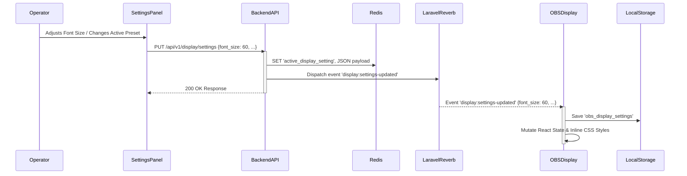

# ARCHITECTURE.md: OBS Display Customization

## System Overview

The **OBS Display Customization** module extends PentasLirik's event-driven architecture to support real-time styling updates (font size, colors, shadow effects, and background box) across the Operator Dashboard, Backend API, WebSocket Broadcast Engine, and the OBS Display Overlay ([OBSDisplay.tsx](file:///home/rodex/Documents/cell/projects/pentas-lirik/frontend/src/components/OBSDisplay.tsx)).

To guarantee **zero-flicker lyric transitions**, the architecture completely decouples visual styling state from dynamic lyric content:
- **Lyric Content (`display:update`)**: Emits text string updates frequently during live events.
- **Active Styling State (`display:settings-updated`)**: Cached persistently in **Browser Storage (`localStorage`)** and React State on the client side, only updating when the active theme is changed by an operator.

## High-Level Architecture Diagram

```mermaid
graph TD
    subgraph User Interfaces
        A["Display Settings Panel (/settings/display)"]
        B["OBS Overlay (OBSDisplay.tsx)"]
        LS["Browser Storage (localStorage)"]
    end

    subgraph Backend Services (Laravel Sail in Docker)
        C["Nginx / Vite Dev Server"]
        D["Backend API (Laravel 13 via Sail)"]
        E["WebSocket Server (Laravel Reverb)"]
        F["Database (MySQL - display_settings table)"]
        G["Cache (Redis - active_display_setting key)"]
    end

    A -- "PUT /api/v1/display/settings" --> C
    B -- "GET /api/v1/display/settings (Initial Load)" --> C
    B -- "Reads/Writes Active Style" --> LS
    B -- "WebSocket Subscribed (channel: display)" --> C

    C -- "Proxy REST API" --> D
    C -- "Proxy WebSocket" --> E

    D -- "Persists Presets & Set Active (is_active=1)" --> F
    D -- "Caches Active Settings Object" --> G
    D -- "Broadcasts display:settings-updated" --> E

    E -- "Pushes New Style Event" --> B: Updates localStorage & React State
```

## Component Breakdown & Responsibilities

### Display Settings Panel (`DisplaySettingsPanel.tsx`)
*   **Responsibilities:**
    *   Render interactive styling controls (Font Size slider, Color Pickers, Shadow Blur, Background Box toggle & opacity sliders).
    *   Maintain a real-time **Mini OBS Preview Canvas** reflecting pending CSS adjustments instantly.
    *   Dispatch debounced (`300ms`) REST requests to `PUT /api/v1/display/settings` upon modification.
    *   Provide preset profile selection and "Reset to Default" restoration triggers.

### Backend API (`DisplaySettingController.php`)
*   **Responsibilities:**
    *   Expose `GET /api/v1/display/settings` to retrieve the current active theme record (`is_active = 1`).
    *   Expose `PUT /api/v1/display/settings` to update active styling options.
    *   Expose `GET /api/v1/display/presets`, `POST /api/v1/display/presets`, `POST /api/v1/display/presets/{id}/activate`, and `DELETE /api/v1/display/presets/{id}` for preset profiles management.
    *   Enforce single active theme constraint: Atomically set `is_active = 0` for all existing records before setting `is_active = 1` for the target preset.
    *   Cache active settings payload in Redis key `active_display_setting`.
    *   Dispatch `DisplaySettingsUpdatedEvent` to Laravel Reverb.

### WebSocket Engine (`Laravel Reverb`)
*   **Responsibilities:**
    *   Broadcast `display:settings-updated` events on the `display` channel.
    *   Deliver updated styling JSON payloads to all connected `OBSDisplay.tsx` clients in real-time.

### OBS Browser Source Overlay (`OBSDisplay.tsx`)
*   **Responsibilities:**
    *   **Browser Storage (`localStorage`) Caching Strategy**: Upon initial load/mount, check `localStorage.getItem('obs_display_settings')`. If absent, fetch from `/api/v1/display/settings` and write to `localStorage`.
    *   Listen for `display:settings-updated` WebSocket events to update `localStorage` and React state.
    *   **Flicker-Free Lyric Transitions**: When rapid lyric changes occur (`display:update`), apply the cached `localStorage` styling immediately to dynamic text content without making network roundtrips or re-calculating theme state.

### Data Persistence (`MySQL & Redis`)
*   **MySQL:** Stores preset records in the `display_settings` table.
*   **Redis:** Caches active display setting JSON for fast initial state load (< 20ms).

## Sequence Diagram: Display Setting Update Flow



## State Fallback & Reliability

1. **Zero-Flicker Lyric Switching:** Lyric transitions (`display:update`) consume pre-cached styling directly from React State / `localStorage`, ensuring zero network delay or styling flash when switching lyrics.
2. **Initial Load / Reload Synchronization:** When `OBSDisplay.tsx` mounts or reloads, it restores style from `localStorage` immediately, then validates against `/api/v1/display/settings` in the background.
3. **WebSocket Disconnection Fallback:** If the WebSocket connection drops, `OBSDisplay.tsx` uses its cached `localStorage` theme while polling `/api/v1/display/settings` every 500ms for updates.
4. **Atomic Theme Activation:** Backend database transactions guarantee that exactly one row has `is_active = 1` at all times.
