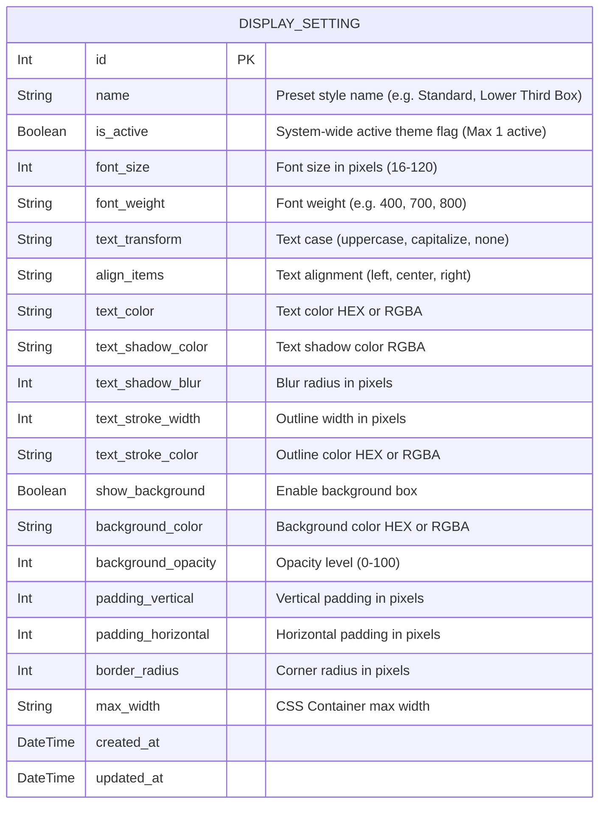

# DATABASE.md: OBS Display Customization

This document outlines the database schema for the **OBS Display Customization** feature in the PentasLirik project (using MySQL provisioned via Laravel Sail Docker environment), detailing the entities, attributes, relationships, table definitions, and Prisma schema definitions.

## 1. Entity Relationship Diagram (ERD)

The system supports multiple display setting presets/themes globally, but **exactly one setting record is marked as active (`is_active = 1`) system-wide** to drive the live OBS Display output. Display settings are system-level configuration records.



## 2. Table Definitions

This section provides detailed definitions for the database tables related to OBS Display Customization.

### 2.1. `display_settings` Table

*   **Purpose:** Stores display configuration presets. Only **one** row with `is_active = 1` acts as the active visual theme for the system's live OBS overlay.
*   **Columns:**

| Column Name | Data Type | Constraints | Description |
|:------------|:----------|:------------------------|:----------------------------------------------|
| `id` | INT | PK, AUTO_INCREMENT | Unique identifier for the display setting. |
| `name` | VARCHAR | NOT NULL, DEFAULT 'Default Style' | Name of the display setting preset. |
| `is_active` | TINYINT(1) | NOT NULL, DEFAULT 1 | Flag indicating if this is the currently active theme (Only 1 active permitted). |
| `font_size` | INT | NOT NULL, DEFAULT 48 | Font size in pixels (16px to 120px). |
| `font_weight` | VARCHAR | NOT NULL, DEFAULT '800' | Font weight value ('400', '600', '700', '800'). |
| `text_transform` | VARCHAR | NOT NULL, DEFAULT 'uppercase' | Text transformation ('uppercase', 'capitalize', 'none'). |
| `align_items` | VARCHAR | NOT NULL, DEFAULT 'center' | Alignment of lyrics text ('left', 'center', 'right'). |
| `text_color` | VARCHAR | NOT NULL, DEFAULT '#FFFFFF' | Font color code (HEX or RGBA format). |
| `text_shadow_color` | VARCHAR | NOT NULL, DEFAULT 'rgba(0,0,0,0.8)' | Color and transparency for text shadow. |
| `text_shadow_blur` | INT | NOT NULL, DEFAULT 10 | Blur radius for text shadow in pixels. |
| `text_stroke_width` | INT | NOT NULL, DEFAULT 0 | Text stroke / outline width in pixels. |
| `text_stroke_color` | VARCHAR | NOT NULL, DEFAULT '#000000' | Text stroke / outline color. |
| `show_background` | TINYINT(1) | NOT NULL, DEFAULT 0 | Toggle to enable/disable background box container. |
| `background_color` | VARCHAR | NOT NULL, DEFAULT 'rgba(0,0,0,0.6)' | Background box color (HEX or RGBA format). |
| `background_opacity` | INT | NOT NULL, DEFAULT 60 | Background opacity percentage (0 - 100). |
| `padding_vertical` | INT | NOT NULL, DEFAULT 16 | Vertical padding inside the background box (px). |
| `padding_horizontal` | INT | NOT NULL, DEFAULT 32 | Horizontal padding inside the background box (px). |
| `border_radius` | INT | NOT NULL, DEFAULT 12 | Border radius for background box corners (px). |
| `max_width` | VARCHAR | NOT NULL, DEFAULT 'max-w-7xl' | Tailwind or CSS max-width container class. |
| `created_at` | TIMESTAMP | NOT NULL, DEFAULT NOW() | Timestamp when the setting was created. |
| `updated_at` | TIMESTAMP | NOT NULL, DEFAULT NOW() | Timestamp of the last update to the setting. |

*   **Indexes:**
    *   `PRIMARY KEY (id)`
    *   `INDEX (is_active)`

## 3. Prisma Schema

This is the Prisma schema model definition for the `DisplaySetting` entity, designed to integrate into the PentasLirik `schema.prisma`.

```prisma
// Represents custom display settings for the OBS Display Overlay.
// Only ONE record should have isActive = true at any given time.
model DisplaySetting {
  id                Int      @id @default(autoincrement())
  name              String   @default("Default Style")
  isActive          Boolean  @default(true) @map("is_active")
  
  // Font & Character Size Settings
  fontSize          Int      @default(48) @map("font_size")
  fontWeight        String   @default("800") @map("font_weight")
  textTransform     String   @default("uppercase") @map("text_transform")
  alignItems        String   @default("center") @map("align_items")
  
  // Text Color & Effect Settings
  textColor         String   @default("#FFFFFF") @map("text_color")
  textShadowColor   String   @default("rgba(0,0,0,0.8)") @map("text_shadow_color")
  textShadowBlur    Int      @default(10) @map("text_shadow_blur")
  textStrokeWidth   Int      @default(0) @map("text_stroke_width")
  textStrokeColor   String   @default("#000000") @map("text_stroke_color")
  
  // Background Box Settings
  showBackground    Boolean  @default(false) @map("show_background")
  backgroundColor   String   @default("rgba(0,0,0,0.6)") @map("background_color")
  backgroundOpacity Int      @default(60) @map("background_opacity")
  paddingVertical   Int      @default(16) @map("padding_vertical")
  paddingHorizontal Int      @default(32) @map("padding_horizontal")
  borderRadius      Int      @default(12) @map("border_radius")
  maxWidth          String   @default("max-w-7xl") @map("max_width")
  
  createdAt         DateTime @default(now()) @map("created_at")
  updatedAt         DateTime @updatedAt @map("updated_at")

  @@map("display_settings")
}
```
