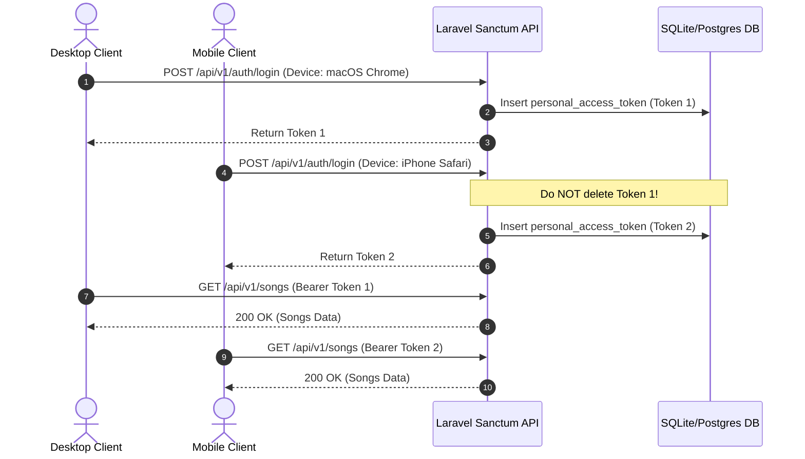
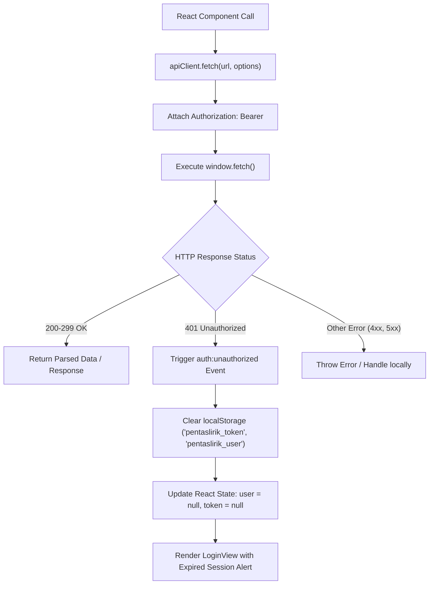

# ARCHITECTURE: Multi-Device Authentication & Automatic Token Expiration Handling

## Technical Overview

This architecture document outlines the structural changes to PentasLirik's authentication layer across both backend (Laravel 13.x + Sanctum) and frontend (React + TypeScript), aligned directly with official Laravel 13.x Sanctum API token standards.

---

## 1. Backend Token Architecture



### Key Changes in `AuthController.php`
* **Token Creation**:
  ```php
  $deviceName = $request->input('device_name', $request->header('User-Agent', 'Unknown Device'));
  $token = $user->createToken($deviceName)->plainTextToken;
  ```
* **Current Access Token Revocation**:
  ```php
  // Only delete current token on logout (Official Sanctum standard)
  $request->user()->currentAccessToken()->delete();
  ```
* **Revoke All Tokens (Optional Endpoint)**:
  ```php
  // Revoke all tokens for account
  $user->tokens()->delete();
  ```

### Token Expiration & Pruning (Laravel 13.x Standard)
* Configured via `config/sanctum.php` (`'expiration' => null` or custom minutes).
* Expired tokens can be automatically pruned from the database via Laravel 13.x Scheduled task:
  ```php
  Schedule::command('sanctum:prune-expired --hours=24')->daily();
  ```

---

## 2. Frontend Centralized HTTP Client Architecture



### Architecture Components:
1. `frontend/src/utils/apiClient.ts`: Unified fetch client that automatically attaches Bearer tokens and listens for `401 Unauthorized`.
2. `Auth Event Emitter / Handler`: Dispatches a custom event `pentaslirik:unauthorized` whenever any API request returns a 401. `App.tsx` subscribes to this event to clear state cleanly.
