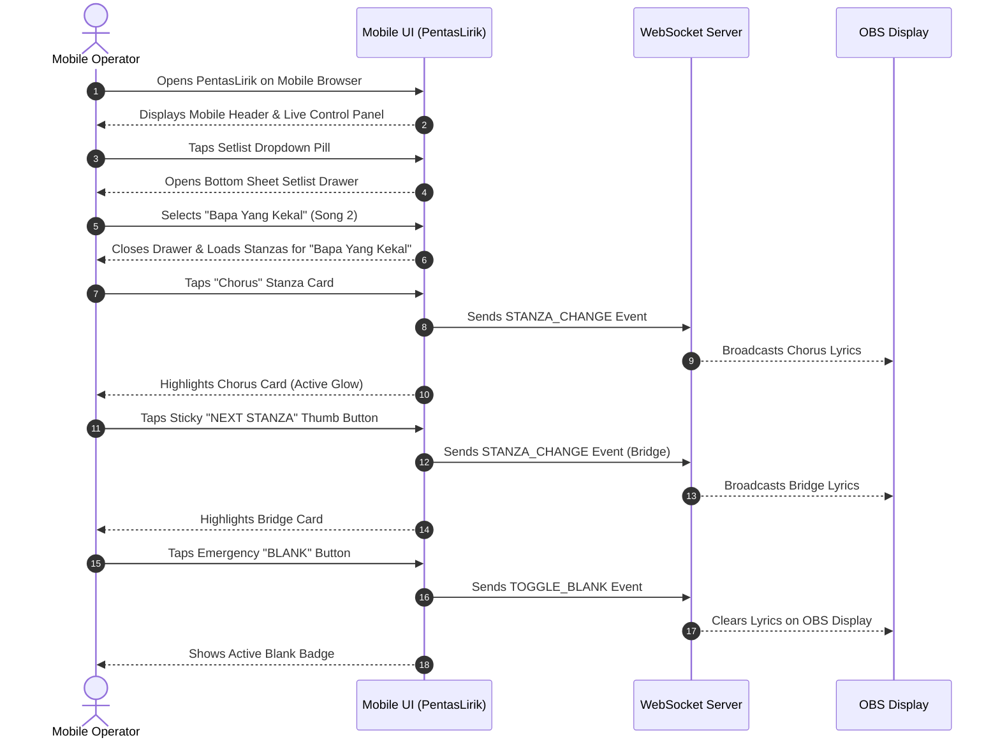

# USER_FLOW: Mobile-First Redesign & Dedicated Mobile Control Panel

## Mobile Operator Journey Map

---

## Key User Interaction Scenarios

### Scenario A: Switching Songs During Live Performance
1. Operator taps top Setlist Selector Pill on mobile control panel.
2. Bottom sheet smoothly slides up presenting all songs in the active setlist with order numbers and keys.
3. Operator taps desired song.
4. Sheet dismisses and the new song's stanzas are rendered instantly on screen ready for one-tap broadcasting.

### Scenario B: One-Handed Stanza Stepping
1. Operator holds phone in one hand.
2. Bottom sticky bar contains `[ PREV STANZA ]` (left thumb zone) and `[ NEXT STANZA ]` (right thumb zone).
3. Operator taps `NEXT STANZA` repeatedly as the worship leader leads the song.
4. OBS overlay updates in real-time with zero delay.
