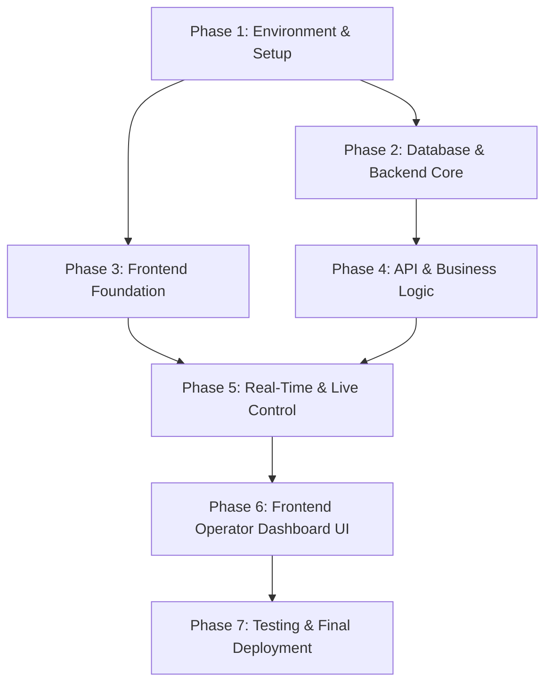

# PentasLirik Development Task Index (Initial Setup - 2026-08-06)

Dokumen ini berisi daftar task terperinci hasil pemecahan (breakdown) blueprint dari folder `docs/feature/2026-08-06_initial-setup/`.

---

## 🗺️ Roadmap & Phase Breakdown

---

## 📋 Task List Overview

| Task ID | Nama Task | Kategori | Prasyarat (Dependencies) | File Spec |
| :--- | :--- | :--- | :--- | :--- |
| **TASK-01** | Docker Environment & Reverse Proxy Setup ✅ | Infrastructure | - | [01-environment-and-docker-setup.md](./01-environment-and-docker-setup.md) |
| **TASK-02** | Backend Initialization (Laravel 13, Sail, Reverb, Redis) ✅ | Backend | TASK-01 | [02-backend-initialization.md](./02-backend-initialization.md) |
| **TASK-03** | Frontend Initialization (React 19, Vite 6, Tailwind CSS v4) ✅ | Frontend | TASK-01 | [03-frontend-initialization.md](./03-frontend-initialization.md) |
| **TASK-04** | Database Schema, Migrations & Eloquent Models ✅ | Database | TASK-02 | [04-database-schema-and-models.md](./04-database-schema-and-models.md) |
| **TASK-05** | Lyric Chunking Parser Service ✅ | Backend | TASK-04 | [05-lyric-chunking-service.md](./05-lyric-chunking-service.md) |
| **TASK-06** | Authentication API & Middleware (Sanctum + RBAC) ✅ | Backend | TASK-04 | [06-auth-api-and-middleware.md](./06-auth-api-and-middleware.md) |
| **TASK-07** | Song & Lyric Management CRUD API ✅ | Backend | TASK-05, TASK-06 | [07-song-and-lyric-crud-api.md](./07-song-and-lyric-crud-api.md) |
| **TASK-08** | Setlist & Setlist Items CRUD API ✅ | Backend | TASK-07 | [08-setlist-crud-api.md](./08-setlist-crud-api.md) |
| **TASK-09** | Real-Time Live State & Reverb Broadcasting API ✅ | Backend | TASK-02, TASK-06 | [09-live-state-and-broadcasting-api.md](./09-live-state-and-broadcasting-api.md) |
| **TASK-10** | OBS Display Layer Component (`OBSDisplay.tsx`) ✅ | Display | TASK-09 | [10-obs-display-layer.md](./10-obs-display-layer.md) |
| **TASK-11** | Frontend Authentication & App Layout Setup ✅ | Frontend | TASK-03, TASK-06 | [11-frontend-auth-and-layout.md](./11-frontend-auth-and-layout.md) |
| **TASK-12** | Frontend Song Library Component (`SongLibrary.tsx`) ✅ | Frontend | TASK-07, TASK-11 | [12-frontend-song-library-component.md](./12-frontend-song-library-component.md) |
| **TASK-13** | Frontend Setlist Rundown Component (`SetlistRundown.tsx`) ✅ | Frontend | TASK-08, TASK-11 | [13-frontend-setlist-component.md](./13-frontend-setlist-component.md) |
| **TASK-14** | Frontend Live Control Panel, Announcements & Shortcuts (`LiveControlPanel.tsx`) ✅ | Frontend | TASK-09, TASK-11 | [14-frontend-live-control-panel-and-shortcuts.md](./14-frontend-live-control-panel-and-shortcuts.md) |
| **TASK-15** | Frontend Admin User Management (`UserManagementModal.tsx`) ✅ | Frontend | TASK-06, TASK-11 | [15-frontend-admin-user-management.md](./15-frontend-admin-user-management.md) |
| **TASK-16** | Integration & End-to-End Verification Testing ✅ | QA / Testing | TASK-01 s/d TASK-15 | [16-testing-and-verification.md](./16-testing-and-verification.md) |
| **TASK-17** | E2E Testing Environment & Playwright Setup ✅ | QA / E2E | TASK-16 | [17-e2e-playwright-setup.md](./17-e2e-playwright-setup.md) |
| **TASK-18** | E2E Auth & Operator Dashboard Navigation Flow ✅ | QA / E2E | TASK-17 | [18-e2e-auth-and-dashboard-flow.md](./18-e2e-auth-and-dashboard-flow.md) |
| **TASK-19** | E2E Live Display Sync & Shortcut Operations ✅ | QA / E2E | TASK-17 | [19-e2e-live-display-and-shortcuts.md](./19-e2e-live-display-and-shortcuts.md) |
| **TASK-20** | E2E Song Library CRUD & Lyric Parsing Flow ✅ | QA / E2E | TASK-17 | [20-e2e-song-crud-and-parsing.md](./20-e2e-song-crud-and-parsing.md) |
| **TASK-21** | E2E Setlist CRUD & Rundown Execution Flow ✅ | QA / E2E | TASK-17 | [21-e2e-setlist-crud-and-rundown.md](./21-e2e-setlist-crud-and-rundown.md) |
| **TASK-22** | E2E Admin User Management & Role Operations ✅ | QA / E2E | TASK-17 | [22-e2e-admin-user-management.md](./22-e2e-admin-user-management.md) |

---

## 📊 Verification Report

Dokumentasi bukti pengujian dapat dilihat di: [VERIFICATION_REPORT.md](./VERIFICATION_REPORT.md)
