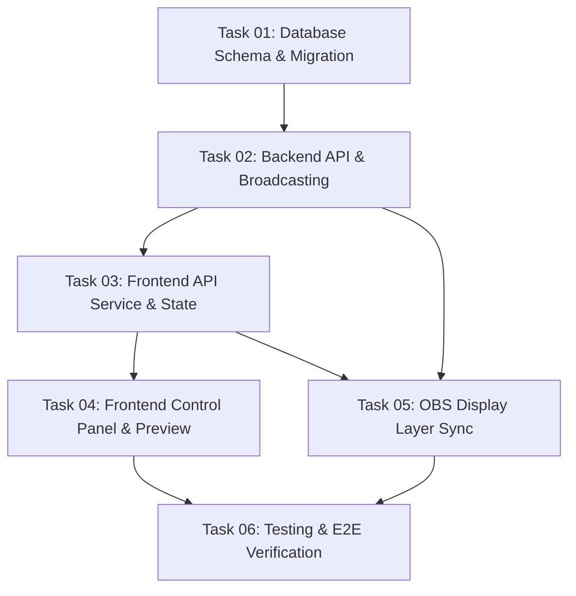

# Feature Task Breakdown: OBS Display Customization

Dokumen ini berisi daftar task terperinci hasil pemecahan (breakdown) blueprint dari folder `docs/feature/obs-display-customization/`. Setiap task dirancang agar independen, terukur, dan dapat dikerjakan secara bertahap.

---

## 🐳 Docker Compose Environment & Terminal Commands

Seluruh perintah terminal dijalankan menggunakan layanan Docker Compose yang telah dikonfigurasi pada [docker-compose.yml](file:///home/rodex/Documents/cell/projects/pentas-lirik/docker-compose.yml):
- **Backend (Laravel / Artisan / Migration / PHPUnit):**  
  `docker compose exec backend php artisan <command>`
- **Frontend (Node / React / Playwright):**  
  `docker compose exec frontend <command>` (atau langsung melalui host environment)
- **Database MySQL:**  
  `docker compose exec mysql mysql -u root -p`
- **Cache Redis:**  
  `docker compose exec redis redis-cli`

---

## 🗺️ Roadmap & Feature Execution Flow

---

## 📋 Task List Overview

| Task ID | Nama Task | Kategori | Prasyarat (Dependencies) | File Spec |
| :--- | :--- | :--- | :--- | :--- |
| **TASK-01** | Database Schema, Migration & Eloquent Model | Database | - | [01-database-schema-and-migration.md](file:///home/rodex/Documents/cell/projects/pentas-lirik/tasks/2026-08-07_obs-display-customization/01-database-schema-and-migration.md) |
| **TASK-02** | Backend API, Validation, Redis Caching & Event Broadcasting | Backend | TASK-01 | [02-backend-api-and-broadcasting.md](file:///home/rodex/Documents/cell/projects/pentas-lirik/tasks/2026-08-07_obs-display-customization/02-backend-api-and-broadcasting.md) |
| **TASK-03** | Frontend TypeScript Types, API Service & State Hook | Frontend Core | TASK-02 | [03-frontend-api-service-and-state.md](file:///home/rodex/Documents/cell/projects/pentas-lirik/tasks/2026-08-07_obs-display-customization/03-frontend-api-service-and-state.md) |
| **TASK-04** | Frontend Display Settings Control Panel & Mini OBS Preview UI | Frontend UI | TASK-03 | [04-frontend-control-panel-and-preview.md](file:///home/rodex/Documents/cell/projects/pentas-lirik/tasks/2026-08-07_obs-display-customization/04-frontend-control-panel-and-preview.md) |
| **TASK-05** | OBS Display Overlay Dynamic Styling & Zero-Flicker Sync (`OBSDisplay.tsx`) | Display Layer | TASK-02, TASK-03 | [05-obs-display-layer-synchronization.md](file:///home/rodex/Documents/cell/projects/pentas-lirik/tasks/2026-08-07_obs-display-customization/05-obs-display-layer-synchronization.md) |
| **TASK-06** | Integration & E2E Playwright Verification Tests | QA / Testing | TASK-04, TASK-05 | [06-testing-and-verification.md](file:///home/rodex/Documents/cell/projects/pentas-lirik/tasks/2026-08-07_obs-display-customization/06-testing-and-verification.md) |

---

## 📌 Status Tracker

- [x] **TASK-01**: Database Schema, Migration & Eloquent Model
- [x] **TASK-02**: Backend API, Validation, Redis Caching & Event Broadcasting
- [x] **TASK-03**: Frontend TypeScript Types, API Service & State Hook
- [x] **TASK-04**: Frontend Display Settings Control Panel & Mini OBS Preview UI
- [x] **TASK-05**: OBS Display Overlay Dynamic Styling & Zero-Flicker Sync (`OBSDisplay.tsx`)
- [x] **TASK-06**: Integration & E2E Playwright Verification Tests
