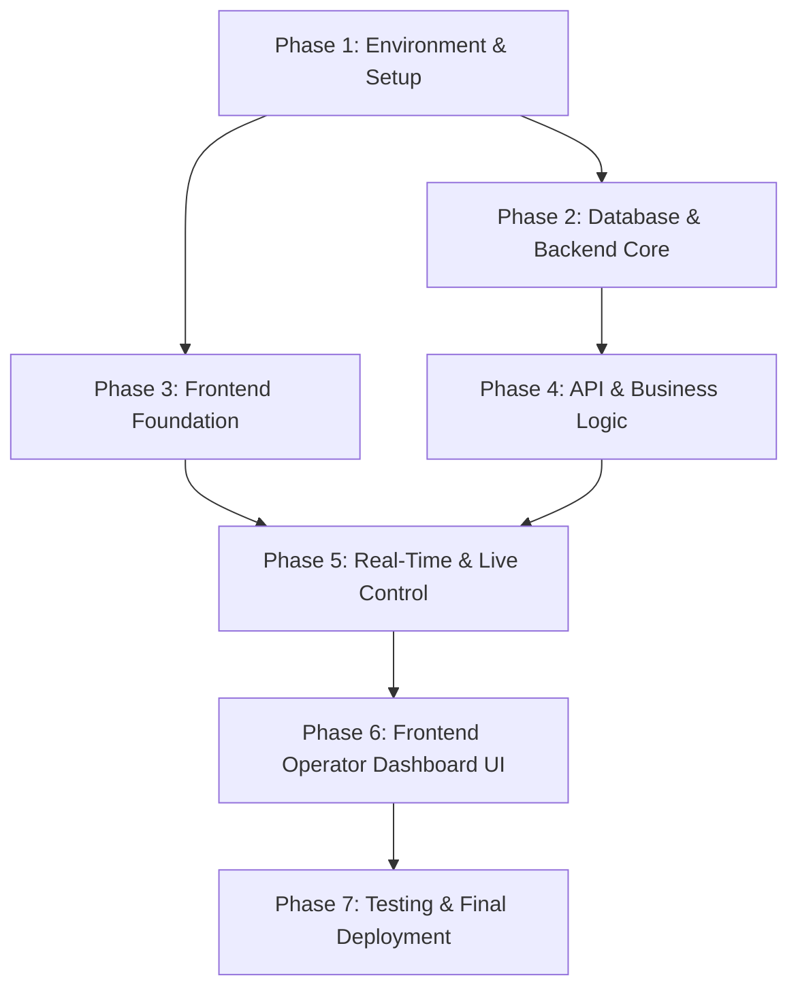

# PentasLirik Development Task Index

Dokumen ini berisi daftar task terperinci hasil pemecahan (breakdown) blueprint dari folder `docs/`. Setiap task dirancang agar independen, terukur, dan dapat dikerjakan secara bertahap.

---

## 🗺️ Roadmap & Phase Breakdown

---

## 📋 Task List Overview

| Task ID | Nama Task | Kategori | Prasyarat (Dependencies) | File Spec |
| :--- | :--- | :--- | :--- | :--- |
| **TASK-01** | Docker Environment & Reverse Proxy Setup ✅ | Infrastructure | - | [01-environment-and-docker-setup.md](file:///home/rodex/Documents/cell/projects/pentas-lirik/tasks/01-environment-and-docker-setup.md) |
| **TASK-02** | Backend Initialization (Laravel 13, Sail, Reverb, Redis) ✅ | Backend | TASK-01 | [02-backend-initialization.md](file:///home/rodex/Documents/cell/projects/pentas-lirik/tasks/02-backend-initialization.md) |
| **TASK-03** | Frontend Initialization (React 19, Vite 6, Tailwind CSS v4) ✅ | Frontend | TASK-01 | [03-frontend-initialization.md](file:///home/rodex/Documents/cell/projects/pentas-lirik/tasks/03-frontend-initialization.md) |
| **TASK-04** | Database Schema, Migrations & Eloquent Models ✅ | Database | TASK-02 | [04-database-schema-and-models.md](file:///home/rodex/Documents/cell/projects/pentas-lirik/tasks/04-database-schema-and-models.md) |
| **TASK-05** | Lyric Chunking Parser Service ✅ | Backend | TASK-04 | [05-lyric-chunking-service.md](file:///home/rodex/Documents/cell/projects/pentas-lirik/tasks/05-lyric-chunking-service.md) |
| **TASK-06** | Authentication API & Middleware (Sanctum + RBAC) ✅ | Backend | TASK-04 | [06-auth-api-and-middleware.md](file:///home/rodex/Documents/cell/projects/pentas-lirik/tasks/06-auth-api-and-middleware.md) |
| **TASK-07** | Song & Lyric Management CRUD API ✅ | Backend | TASK-05, TASK-06 | [07-song-and-lyric-crud-api.md](file:///home/rodex/Documents/cell/projects/pentas-lirik/tasks/07-song-and-lyric-crud-api.md) |
| **TASK-08** | Setlist & Setlist Items CRUD API ✅ | Backend | TASK-07 | [08-setlist-crud-api.md](file:///home/rodex/Documents/cell/projects/pentas-lirik/tasks/08-setlist-crud-api.md) |
| **TASK-09** | Real-Time Live State & Reverb Broadcasting API ✅ | Backend | TASK-02, TASK-06 | [09-live-state-and-broadcasting-api.md](file:///home/rodex/Documents/cell/projects/pentas-lirik/tasks/09-live-state-and-broadcasting-api.md) |
| **TASK-10** | OBS Display Layer Component (`OBSDisplay.tsx`) ✅ | Display | TASK-09 | [10-obs-display-layer.md](file:///home/rodex/Documents/cell/projects/pentas-lirik/tasks/10-obs-display-layer.md) |
| **TASK-11** | Frontend Authentication & App Layout Setup ✅ | Frontend | TASK-03, TASK-06 | [11-frontend-auth-and-layout.md](file:///home/rodex/Documents/cell/projects/pentas-lirik/tasks/11-frontend-auth-and-layout.md) |
| **TASK-12** | Frontend Song Library Component (`SongLibrary.tsx`) ✅ | Frontend | TASK-07, TASK-11 | [12-frontend-song-library-component.md](file:///home/rodex/Documents/cell/projects/pentas-lirik/tasks/12-frontend-song-library-component.md) |
| **TASK-13** | Frontend Setlist Rundown Component (`SetlistRundown.tsx`) ✅ | Frontend | TASK-08, TASK-11 | [13-frontend-setlist-component.md](file:///home/rodex/Documents/cell/projects/pentas-lirik/tasks/13-frontend-setlist-component.md) |
| **TASK-14** | Frontend Live Control Panel, Announcements & Shortcuts (`LiveControlPanel.tsx`) ✅ | Frontend | TASK-09, TASK-11 | [14-frontend-live-control-panel-and-shortcuts.md](file:///home/rodex/Documents/cell/projects/pentas-lirik/tasks/14-frontend-live-control-panel-and-shortcuts.md) |
| **TASK-15** | Frontend Admin User Management (`UserManagementModal.tsx`) ✅ | Frontend | TASK-06, TASK-11 | [15-frontend-admin-user-management.md](file:///home/rodex/Documents/cell/projects/pentas-lirik/tasks/15-frontend-admin-user-management.md) |
| **TASK-16** | End-to-End Integration, Latency Testing & Verification ✅ | QA / Verification | All Previous Tasks | [16-testing-and-verification.md](file:///home/rodex/Documents/cell/projects/pentas-lirik/tasks/16-testing-and-verification.md) |
| **TASK-17** | Playwright E2E Testing Framework Setup & Configuration ✅ | E2E Testing | TASK-03, TASK-11 | [17-e2e-playwright-setup.md](file:///home/rodex/Documents/cell/projects/pentas-lirik/tasks/17-e2e-playwright-setup.md) |
| **TASK-18** | E2E Auth & Dashboard User Journey Tests ✅ | E2E Testing | TASK-17 | [18-e2e-auth-and-dashboard-flow.md](file:///home/rodex/Documents/cell/projects/pentas-lirik/tasks/18-e2e-auth-and-dashboard-flow.md) |
| **TASK-19** | E2E Live Display Sync & Keyboard Shortcuts Tests ✅ | E2E Testing | TASK-17, TASK-18 | [19-e2e-live-display-and-shortcuts.md](file:///home/rodex/Documents/cell/projects/pentas-lirik/tasks/19-e2e-live-display-and-shortcuts.md) |
| **TASK-20** | E2E Song CRUD, Lyric Parsing & Song Switching Tests ✅ | E2E Testing | TASK-17, TASK-18 | [20-e2e-song-crud-and-parsing.md](file:///home/rodex/Documents/cell/projects/pentas-lirik/tasks/20-e2e-song-crud-and-parsing.md) |
| **TASK-21** | E2E Setlist CRUD & Rundown Management Tests ✅ | E2E Testing | TASK-17, TASK-18 | [21-e2e-setlist-crud-and-rundown.md](file:///home/rodex/Documents/cell/projects/pentas-lirik/tasks/21-e2e-setlist-crud-and-rundown.md) |
| **TASK-22** | E2E Admin User Management & Role Operations Tests ✅ | E2E Testing | TASK-17, TASK-18 | [22-e2e-admin-user-management.md](file:///home/rodex/Documents/cell/projects/pentas-lirik/tasks/22-e2e-admin-user-management.md) |

---

## 📌 Status Tracker

- [x] **TASK-01**: Environment & Docker Setup
- [x] **TASK-02**: Backend Initialization (Laravel 13 via Sail, Reverb, Redis)
- [x] **TASK-03**: Frontend Initialization (React 19, Vite 6, Tailwind v4)
- [x] **TASK-04**: Database Schema & Models
- [x] **TASK-05**: Lyric Chunking Parser
- [x] **TASK-06**: Auth API & RBAC
- [x] **TASK-07**: Songs CRUD API
- [x] **TASK-08**: Setlist CRUD API
- [x] **TASK-09**: Live State & Reverb API
- [x] **TASK-10**: OBS Display Layer Component
- [x] **TASK-11**: Frontend Auth & Layout
- [x] **TASK-12**: Frontend Song Library UI
- [x] **TASK-13**: Frontend Setlist UI
- [x] **TASK-14**: Frontend Live Control & Shortcuts UI
- [x] **TASK-15**: Frontend Admin UI
- [x] **TASK-16**: E2E Integration & Verification
- [x] **TASK-17**: Playwright Setup & Configuration
- [x] **TASK-18**: E2E Auth & Dashboard Tests
- [x] **TASK-19**: E2E Live Display & Shortcuts Tests
- [x] **TASK-20**: E2E Song CRUD & Parsing Tests
- [x] **TASK-21**: E2E Setlist CRUD & Rundown Tests
- [x] **TASK-22**: E2E Admin User Management Tests
